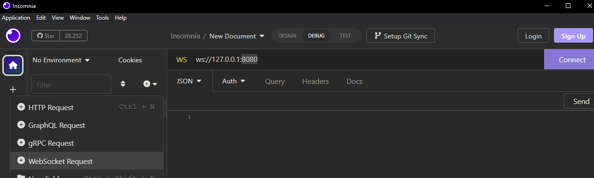
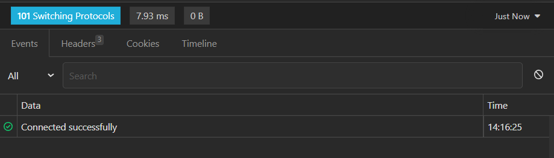
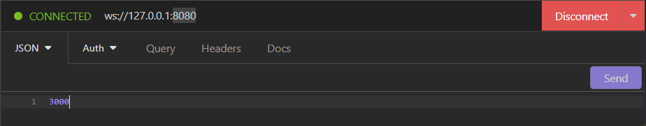
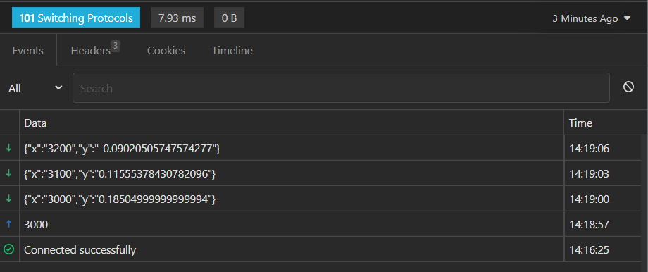

## Description
This application return in real time indexes to a graphic that can be ploted by any frontend client
## Basic scripts
### To build project and add husky configuration

(to know more about husky: https://typicode.github.io/husky/#/)

```
$ yarn build
```

### Or if you wanna just create .husky folder with pre-push and pre-commit files

```
$ yarn prepare
```

### To start project from dist folder

```
$ yarn start
```

### To start project from src folder with nodemon

(to know more about nodemon: https://nodemon.io/)

```
$ yarn dev
```

### Run all the test suits

```
$ yarn test
```

### Select wich suit you wanna run in watch mode or related files uncommited by git

(know more in: https://jestjs.io/docs/cli)

```
$ yarn test:watch
```

### Run all the tests and generate bunch of informations about project test coverage

```
$ yarn test:coverage
```

### To start project from docker container

(know more in: https://docs.docker.com/get-started/ and https://docs.docker.com/compose/gettingstarted/)

```
$ docker-compose up
```
To build a container and then start automatically

## Project folders schema
```
graphic-generator
├─ .circleci
│  └─ config.yml
├─ .dockerignore
├─ .editorconfig
├─ .eslintignore
├─ .eslintrc.json
├─ .gitignore
├─ .prettierrc.json
├─ Dockerfile
├─ README.md
├─ docker-compose.yml
├─ jest.config.js
├─ nodemon.json
├─ package.json
├─ src
│  ├─ common
│  │  └─ environment-consts.ts
│  └─ services
│     ├─ graphic-generator-service.ts
│     ├─ interfaces
│     │  └─ interfaces.ts
│     └─ ws-server.ts
│  ├─ index.ts
├─ tests
│  ├─ graphic-generator-service.spec.ts
│  └─ ws-server.spec.ts
├─ tsconfig-build.json
├─ tsconfig.json
├─ yarn-error.log
└─ yarn.lock
```

## Basic Usage

To use in dev environment just run this command
```
$ yarn dev
```

Then, use some request client as Insomnia, Postman or any you prefer. In this exemple i used insomnia.
In your client, create a new websocket request and put the port and url setted up in your project copy



Now click in connect and a message of success will be returned down bellow



With the client properly connect, you can send the message and the application will return the indexes






